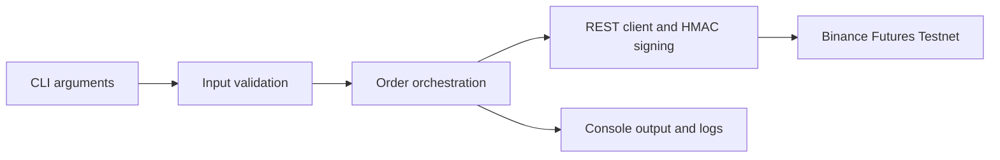

# Binance Futures Testnet Trading Bot

A simple Python CLI tool to place orders on the Binance Futures Testnet (USDT-M). Supports Market, Limit, and Stop-Market orders with input validation, structured logging, and clear error handling.

Built with direct REST calls (`httpx` + HMAC-SHA256 signing) rather than a wrapper library, to keep things transparent and dependency-light.

## Quick Start

```bash
# 1. Clone and set up
git clone <repository-url>
cd trading_bot
python -m venv .venv
.venv\Scripts\activate        # Windows
# source .venv/bin/activate   # macOS/Linux
pip install -r requirements.txt

# 2. Configure API credentials
cp .env.example .env
# Edit .env with your Binance Futures Testnet API key and secret

# 3. Place an order
python cli.py --symbol BTCUSDT --side BUY --type MARKET --quantity 0.001
```

## Usage Examples

**Market order** -- executes immediately at current price:
```bash
python cli.py --symbol BTCUSDT --side BUY --type MARKET --quantity 0.001
```

**Limit order** -- sits on the book until filled or cancelled:
```bash
python cli.py --symbol BTCUSDT --side SELL --type LIMIT --quantity 0.001 --price 120000
```

**Stop-Market order** (bonus) -- triggers a market order when price reaches your stop:
```bash
python cli.py --symbol BTCUSDT --side SELL --type STOP_MARKET --quantity 0.001 --stop-price 60000
```

**View all options:**
```bash
python cli.py --help
```

### Sample Output

```
  Order Request Summary
+----------------------+
| Parameter  | Value   |
|------------+---------|
| Symbol     | BTCUSDT |
| Side       | BUY     |
| Order Type | MARKET  |
| Quantity   | 0.001   |
+----------------------+

       Order Response
+-----------------------------+
| Field         | Value       |
|---------------+-------------|
| Order ID      | 14832729688 |
| Symbol        | BTCUSDT     |
| Side          | BUY         |
| Type          | MARKET      |
| Status        | NEW         |
| Ordered Qty   | 0.0010      |
+-----------------------------+

+--- Success ----------------------------------+
| Order placed successfully!                   |
| Order ID: 14832729688  |  Status: NEW        |
+----------------------------------------------+
```

## Project Structure

```
trading_bot/
├── bot/
│   ├── __init__.py          # package marker
│   ├── client.py            # Binance REST client (signing, HTTP, error codes)
│   ├── orders.py            # order placement logic (validate -> call API -> format)
│   ├── validators.py        # input validation helpers
│   └── logging_config.py    # file + console logging setup
├── cli.py                   # CLI entry point (Typer + Rich)
├── logs/
│   └── trading_bot.log      # auto-generated, gitignored
├── .env.example
├── .gitignore
├── requirements.txt
└── README.md
```

The code is split into two layers:
- **`bot/`** -- the reusable library (client, order logic, validators, logging). This could be imported into other scripts or a web app without touching the CLI.
- **`cli.py`** -- the thin CLI wrapper that parses arguments, calls into `bot/`, and formats output.

## Setup

### Prerequisites

- Python 3.10+
- A [Binance Futures Testnet](https://testnet.binancefuture.com) account (sign in with GitHub, generate API keys from the dashboard)

### Configuration

Copy `.env.example` to `.env` and fill in your testnet credentials:

```
BINANCE_TESTNET_API_KEY=your_key_here
BINANCE_TESTNET_API_SECRET=your_secret_here
```

The `.env` file is gitignored so credentials stay local.

## How It Works

1. **CLI parses input** -- Typer handles argument parsing and basic type checking.
2. **Validators run** -- symbol, side, order type, quantity, and price are validated before anything hits the network. Clear `ValueError` messages if something's wrong.
3. **Client signs and sends** -- the `BinanceClient` adds a timestamp + HMAC-SHA256 signature, sends the request, and parses the response. On initialization, it syncs with Binance's server clock to avoid timestamp drift errors (`-1021`).
4. **Routing** -- standard orders (MARKET, LIMIT) go to `POST /fapi/v1/order`. Conditional orders (STOP_MARKET) go to `POST /fapi/v1/algoOrder` with `algoType=CONDITIONAL`, since Binance moved these to a separate endpoint.
5. **Output** -- Rich tables display the request summary and response details. Errors are shown in colored panels with the specific Binance error code and a human-readable hint.

## Logging

All API activity is logged to `logs/trading_bot.log` in JSON format (one line per entry):

```json
{"timestamp": "2026-06-11T16:54:15.123+00:00", "level": "INFO", "module": "orders", "message": "Placing MARKET BUY order: BTCUSDT qty=0.001"}
{"timestamp": "2026-06-11T16:54:15.456+00:00", "level": "DEBUG", "module": "client", "message": ">>> POST /fapi/v1/order params={...}"}
{"timestamp": "2026-06-11T16:54:15.789+00:00", "level": "DEBUG", "module": "client", "message": "<<< 200 {\"orderId\": 14832729688, ...}"}
{"timestamp": "2026-06-11T16:54:15.790+00:00", "level": "INFO", "module": "orders", "message": "Order placed successfully - orderId=14832729688 status=NEW"}
```

Console output is INFO-level only (no noise). The file captures DEBUG-level detail for troubleshooting.

## Error Handling

The bot handles three categories of errors:

| Error Type | Example | What Happens |
|---|---|---|
| **Validation** | Missing `--price` for LIMIT | Clear message before any network call |
| **API** | Insufficient margin (`-2019`) | Shows Binance error code + explanation |
| **Network** | Timeout, DNS failure | Caught and reported cleanly |

Common Binance error codes are mapped to plain-English hints (see `_ERROR_HINTS` in `client.py`).

## Assumptions

1. **Testnet only** -- built for `https://testnet.binancefuture.com`. Don't point it at production.
2. **USDT-M futures** -- expects pairs like BTCUSDT, ETHUSDT (not coin-margined).
3. **Single orders** -- no position tracking, no PnL, no risk management. Just places orders.
4. **GTC default** -- limit orders use Good-Til-Cancelled unless you modify the code.
5. **Clock sync** -- the client auto-syncs with Binance's server on each run, so local clock drift is handled.

## Dependencies

| Package | Why |
|---|---|
| `httpx` | HTTP client for API calls |
| `typer` | CLI argument parsing |
| `rich` | Pretty terminal output (tables, panels, colors) |
| `python-dotenv` | Load `.env` credentials |

All listed in `requirements.txt`. No heavy frameworks.

---

## Architecture

The command line validates a requested order before the API client signs and sends it to the Binance USDT-M Futures Testnet. The client handles the response and errors; structured logging records activity for debugging.


